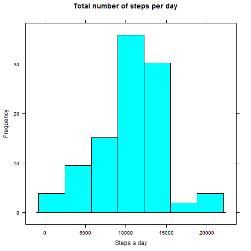
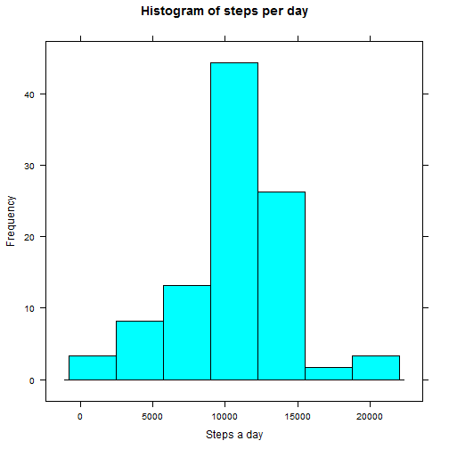

Reproducible research programming assignment No. 1
========================================================

This is a solution for programming ssignment No. 1. Note that it is assumed that
the csv file for analisys is downloaded and extracted in the working directory.

Before you start load (and install of course) lattice library:


```r
library(lattice)
```


First read the csv file:


```r
activity <- read.csv("activity.csv", colClasses = c("numeric", "Date", "numeric"))
```


Get the info about the data:

```r
str(activity)
```

```
## 'data.frame':	17568 obs. of  3 variables:
##  $ steps   : num  NA NA NA NA NA NA NA NA NA NA ...
##  $ date    : Date, format: "2012-10-01" "2012-10-01" ...
##  $ interval: num  0 5 10 15 20 25 30 35 40 45 ...
```


Aggregate steps per day:

```r
stepsperday <- aggregate(steps ~ date, data = activity, sum, na.rm = TRUE)
```


Plot the histogram

```r
histogram(stepsperday$steps, main = "Total number of steps per day", xlab = "Steps a day", 
    ylab = "Frequency")
```

 


Mean of total steps taken per day

```r
mean(stepsperday$steps, na.rm = TRUE)
```

```
## [1] 10766
```


Median of total steps taken per day

```r
median(stepsperday$steps, na.rm = TRUE)
```

```
## [1] 10765
```


## What is the average daily activity pattern?


```r
interval_mean <- aggregate(steps ~ interval, data = activity, mean, na.rm = TRUE)
xyplot(steps ~ interval, data = interval_mean, type = "l")
```

 


Time interval with maximum steps taken per day

```r
interval_mean[which.max(interval_mean$steps), ]$interval
```

```
## [1] 835
```


## Imputing missing values

Number of missing values

```r
nas <- is.na(activity$steps)
sum(nas)
```

```
## [1] 2304
```


### New dataset without missing values

```r
total <- merge(activity, interval_mean, by = "interval", suffixes = c("", "_fill"))
total[is.na(total$steps), ]$steps <- total[is.na(total$steps), ]$steps_fill
total <- total[order(total$date, total$interval), c("steps", "date", "interval")]
```


Histogram of the total number of steps taken each day

```r
total.steps_per_day <- aggregate(steps ~ date, data = total, sum, na.rm = TRUE)
histogram(total.steps_per_day$steps, main = "Histogram of steps per day", xlab = "Steps a day", 
    ylab = "Frequency")
```

 


Mean and median of total steps taken per day

```r
mean(total.steps_per_day$steps)
```

```
## [1] 10766
```

```r
median(total.steps_per_day$steps)
```

```
## [1] 10766
```


## Are there differences in activity patterns between weekdays and weekends?

```r
weekend <- weekdays(as.Date(total$date)) %in% c("Sunday", "Saturday")
total$day_type = factor(ifelse(weekend, "weekend", "weekday"))
```


Compare activity in weekdays and weekends 

```r
interval_mean_day_type <- aggregate(steps ~ interval + day_type, total, mean)
xyplot(steps ~ interval | day_type, interval_mean_day_type, type = "l", layout = c(1, 
    2), xlab = "Interval", ylab = "Number of steps")
```

 

